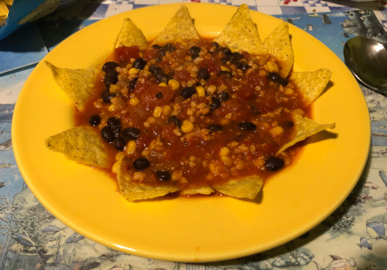

# Chili sin carne

_Variation eines Rezepts von veganpowercooking.de (Originalrezept dort nicht mehr auffindbar)._  
_vegan, laktose- und glutenfrei_

----

## Zutaten für 2 Personen

* Olivenöl
* 1-2 Zwiebeln
* 2 Dosen Tomatenstücke, je 400 g
* 200 ml Gemüsebrühe
* 75–100 g Sojagranulat
* eine Dose gegarte schwarze Bohnen oder Kidneybohnen
* eine kleine Dose Zuckermais
* 1 TL Oregano, getrocknet
* 1½ TL Zimt, gemahlen oder von der Stange gerieben
* 1 TL Kreuzkümmel, gemahlen
* Salz
* ½ Habanero
* 35 g Kakaosplitter
* etwas Zucker
* Saft einer halben Limette

optional:
* 2 Knoblauchzehen, in feine Scheiben geschnitten
* eine rote Paprikaschote

zum Anrichten:
* Nachos (nur gesalzen)
* Koriandergrün, falls zur Hand

## Zubereitung

Zwiebel in Würfel schneiden und in in einem großen Topf mit dem Öl anschwitzen.

Mit den Dosentomaten und der Gemüsebrühe aufgießen und das Sojagranulat
beigeben. Salz, Kreuzkümmel, Zimt und Oregano beigeben und köcheln lassen,
bis das Sojagranulat nicht mehr hart ist (ca. 15 Minuten).

Kidneybohnen und Mais abseihen und abspülen und dazugeben.
Die halbe Habanero-Schote (*mit Gummihandschuhen*)
in kleine Stücke schneiden (Kerne entfernen) und ebenso wie die
Kakaosplitter dazugeben. Gut durchrühren und noch einmal aufkochen lassen.

Zum Schluss noch einmal mit Salz, Zucker und einem
Schuss Limettensaft abschmecken, mit den Korianderblättern bestreuen
und mit den Nachos servieren.
